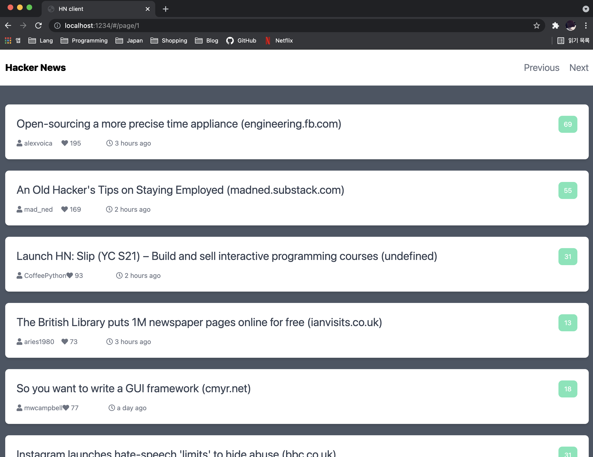
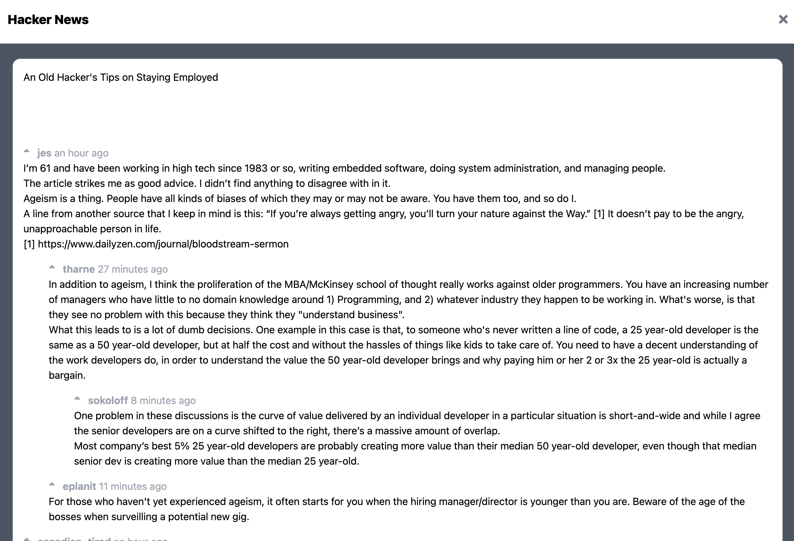
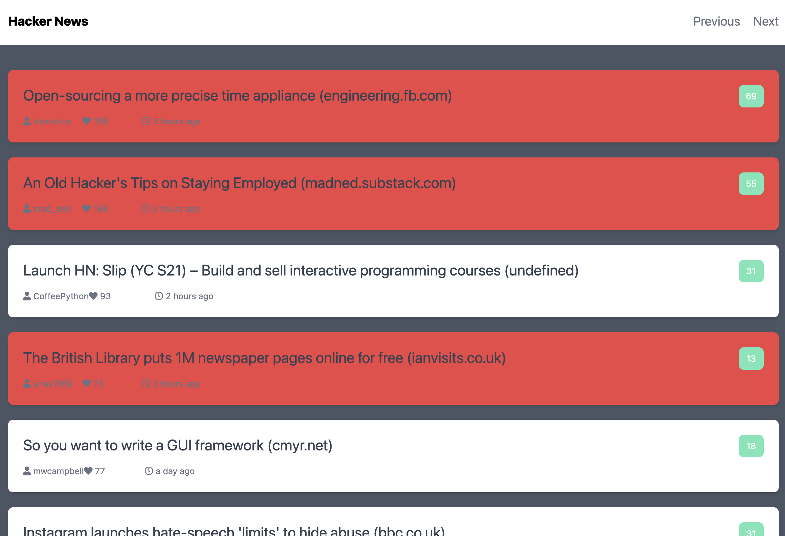

# # Hacker News Clone Coding with AJAX

I studied the basics of AJAX, and thought about how to write code that others can understand easily.

# # Pages Screenshot

## # Feeds list

## # Replies

## # Read /Unread status

